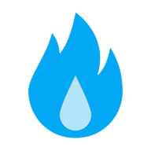
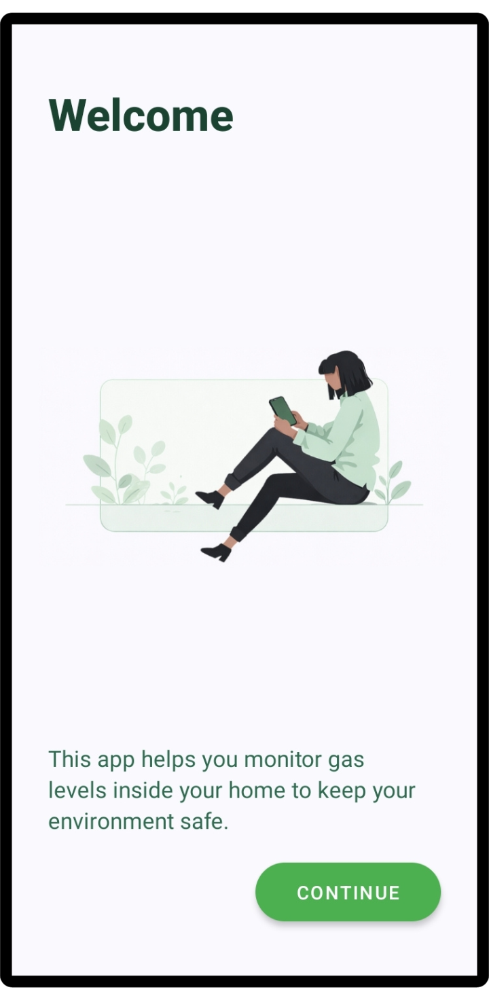
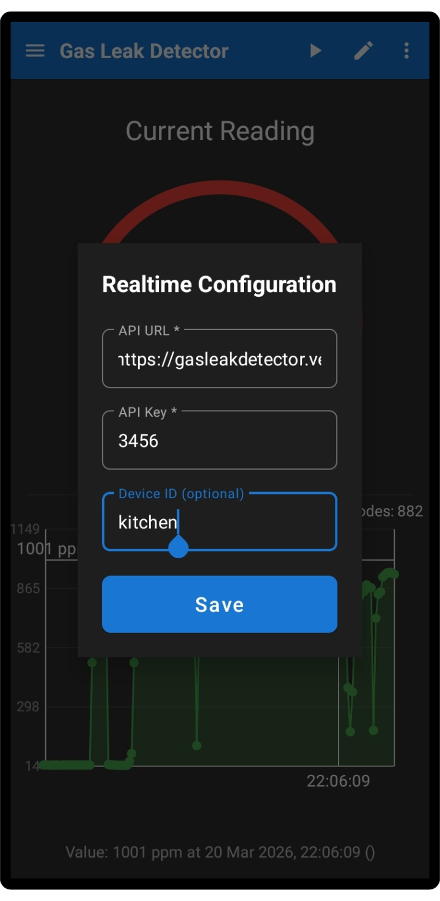
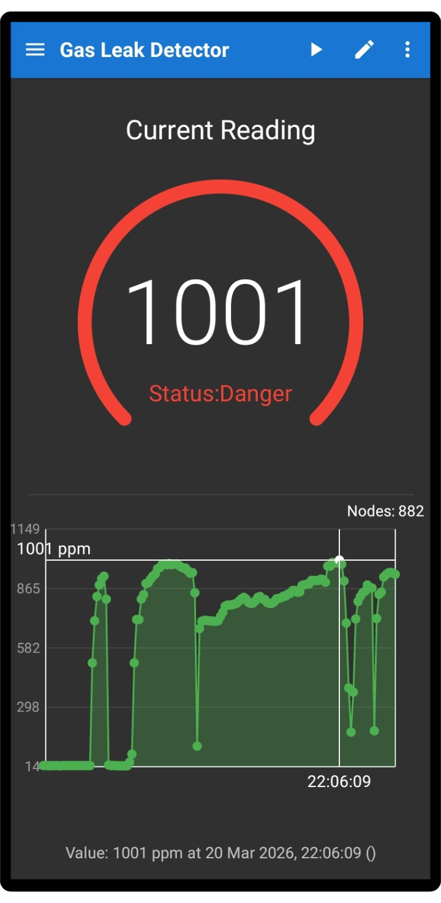
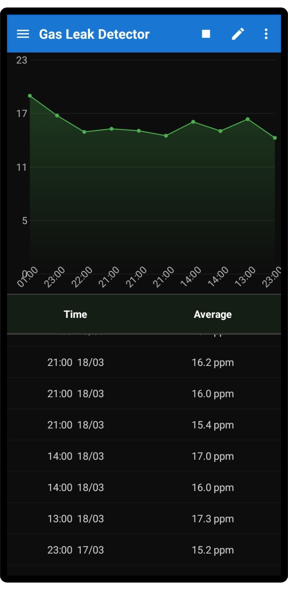
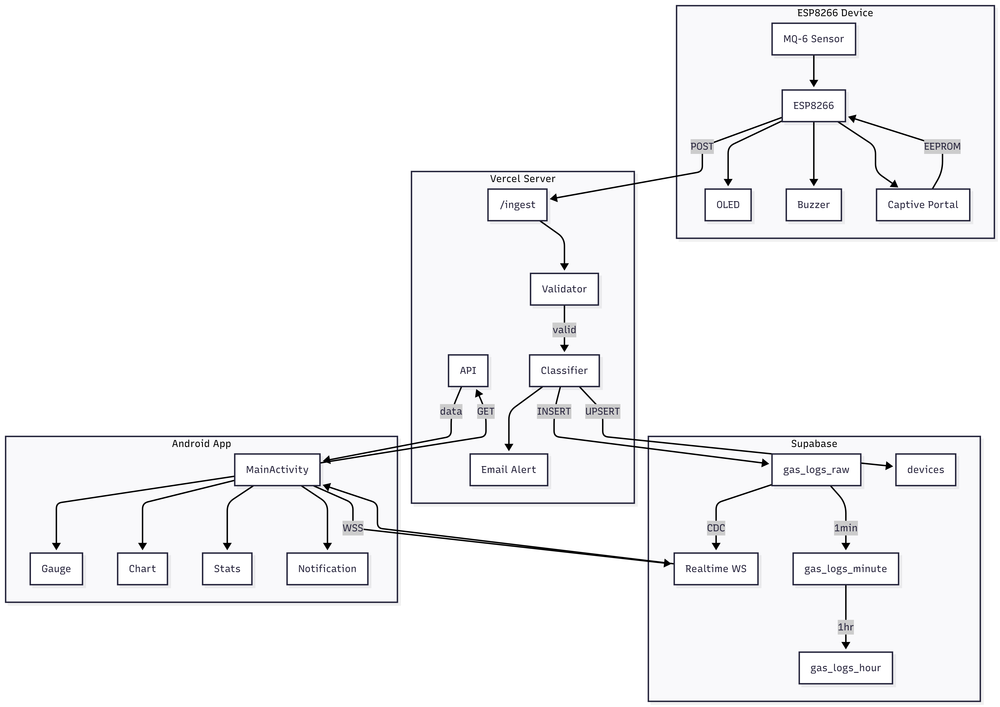

<p align="center">    
      
</p>

<p align="center">
  
  
  
  
  
</p>

<div align="center">    
  <h1>Gas Leak Detector — App</h1>
  <p align="center">Real-time gas monitoring for Android — powered by ESP8266, Supabase, and a serverless edge API.</p>
      
      
      
      
  <br/>    
  <br/>    
</div>

## Overview

Gas Leak Detector is a full-stack IoT safety system. An MQ-6 sensor on an ESP8266 continuously samples ambient gas levels and pushes readings to a serverless Vercel API. Data is persisted in Supabase and streamed in real time to the Android app via WebSocket — no polling, no delay.

The system is composed of three independent repositories that form one pipeline:

| Layer | Repo | Stack |
|---|---|---|
| Firmware | [gasleakdetector-esp](https://github.com/gasleakdetector/gasleakdetector-esp) | C++ / Arduino / ESP8266 |
| Backend | [gasleakdetector-server](https://github.com/gasleakdetector/gasleakdetector-server) | Node.js / Vercel / Supabase |
| Mobile | **gasleakdetector** *(this repo)* | Android / Java |

## Sample Demo

[Watch Demo Video](https://www.youtube.com/watch?v=RLNf9Zphb1I)

## Setup Full Project

You can view a detailed guide on how to set up the entire project [Here](Tutorial/README.md)

## System Flow

<p align="center">
  
</p>

1. ESP8266 reads the MQ-6 sensor every 400 ms and POSTs to `/api/ingest` with API key authentication.
2. The Vercel edge function classifies the reading (`normal / warning / danger`) and writes to Supabase. Email alerts fire on `danger` with a configurable cooldown.
3. `pg_cron` inside Supabase aggregates raw rows into per-minute and per-hour buckets automatically — no external scheduler needed.
4. The Android app fetches Supabase credentials from `/api/realtime-config` and opens a WebSocket subscription directly to `gas_logs_raw` for zero-latency live updates.
5. Historical charts read from pre-aggregated hour buckets, keeping queries fast regardless of how long the device has been running.

## Features

- [x] Live PPM gauge with animated value and real-time WebSocket updates
- [x] Status classification — Normal / Warning / Danger with color feedback
- [x] Persistent danger notification while gas levels remain critical
- [x] Historical chart — hourly aggregated data with dynamic Y-axis
- [x] Multi-node support — switch between ESP devices by `device_id`
- [x] Cursor-based pagination — fetches up to 1,000 rows per request with gzip compression
- [x] Offline resilience — ESP queues up to 60 readings locally; app shows cached data
- [x] First-run intro screen — shown once, skipped on all subsequent launches
- [x] Feedback — one-tap email prefilled with app version in the subject
- [x] Internationalization — 8 languages: English, Vietnamese, German, Spanish, French, Japanese, Korean, Chinese
- [ ] Widget
- [ ] Multi-threshold configuration per device
- [ ] Push notifications via FCM

## Data Management

The core of this project is a **three-tier storage pipeline** built entirely inside Supabase, designed to handle high-frequency sensor ingestion while keeping storage bounded and queries fast at any scale.

**Tier 1 — `gas_logs_raw`**
Every sensor reading is written here on arrival. Supabase Realtime broadcasts each insert over WebSocket to the Android app instantly. This table is write-heavy and grows fast — a single device sending at the default interval produces thousands of rows per hour.

**Tier 2 — `gas_logs_minute`**
`pg_cron` aggregates raw rows into per-minute buckets every minute, computing `avg / min / max / sample_count` per device. Status uses worst-case logic: a single `danger` reading anywhere in the bucket marks the entire bucket as `danger`. This is the intermediate layer — granular enough for short-range views, small enough to query quickly.

**Tier 3 — `gas_logs_hour`**
Every hour, minute buckets are rolled up into hour buckets. The statistics chart in the app reads exclusively from this table — it never touches raw data. Query time is constant regardless of how long devices have been running.

**Auto-cleanup**
`pg_cron` runs a daily purge at 03:00 UTC that deletes all `normal` rows from `gas_logs_raw` older than 48 hours. By that point every reading has already been captured in the minute and hour aggregates, so no historical information is lost. Rows with `warning` or `danger` status are kept indefinitely for audit purposes.

Without this, a device sending at 5 readings/second would accumulate ~430,000 raw rows per day. With the purge in place, `gas_logs_raw` stays bounded to roughly the last 48 hours of normal readings — storage costs remain flat as uptime grows.

## Getting Started

### Prerequisites

- Android Studio Flamingo or later
- JDK 17
- A running instance of [gasleakdetector-server](https://github.com/gasleakdetector/gasleakdetector-server)

### Build

```shell
git clone https://github.com/gasleakdetector/gasleakdetector.git
cd gasleakdetector
./gradlew assembleDebug
```

### Configuration

Open **Settings** in the app and fill in:

| Field | Description |
|---|---|
| API URL | Your Vercel deployment URL, e.g. `https://your-app.vercel.app` |
| API Key | The `VALID_API_KEY` set in your Vercel environment variables |
| Device ID | The `device_id` your ESP is sending, e.g. `ESP_GASLEAK_01` (Leave this field blank if you want to include all devices.) |

The app fetches Supabase credentials automatically from `/api/realtime-config` — no Supabase keys need to be entered manually.

## Release

Download the latest APK from the [Releases](https://github.com/gasleakdetector/gasleakdetector/releases) page.

[](https://github.com/gasleakdetector/gasleakdetector/releases/latest)

Each release includes a signed debug APK and the full source snapshot. CI builds are triggered automatically on every push via [GitHub Actions](https://github.com/gasleakdetector/gasleakdetector/actions).

## Related Repositories

| Repo | Description |
|---|---|
| [gasleakdetector-server](https://github.com/gasleakdetector/gasleakdetector-server) | Vercel serverless API — ingestion, historical query, stats, email alerts |
| [gasleakdetector-esp](https://github.com/gasleakdetector/gasleakdetector-esp) | ESP8266 firmware — MQ-6 reader, WiFi captive portal, offline queue |

## License

Apache 2.0 © [Gas Leak Detector](LICENSE)
