# Hướng Dẫn Cài Đặt

Hướng dẫn đầy đủ để cài đặt dự án Gas Leak Detector. Tài liệu này bao gồm cả bốn thành phần — server backend, Supabase, firmware ESP8266 và ứng dụng Android — theo đúng thứ tự cần thực hiện.

## Yêu Cầu

### Phần Cứng

| Thiết Bị | Ghi Chú |
|-----------|---------|
| ESP8266 | NodeMCU hoặc tương đương |
| Cảm biến khí MQ-6 | Phát hiện LPG / propane |
| OLED SSD1306 0.96" | Tùy chọn — hiển thị thông số trên thiết bị |
| Buzzer | Chủ động hoặc bị động |

### Tài Khoản Cần Có

- [Vercel](https://vercel.com) — triển khai serverless
- [Supabase](https://supabase.com) — cơ sở dữ liệu và realtime
- [Resend](https://resend.com) — cảnh báo qua email (tùy chọn)

---

## 1. Server Backend

### Triển Khai Lên Vercel

**Bước 1.** Truy cập repository [gasleakdetector-server](https://github.com/gasleakdetector/gasleakdetector-server) và nhấn nút **Deploy**.

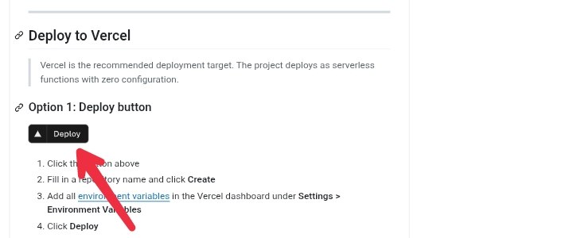

**Bước 2.** Mở dự án trong Vercel dashboard và vào **Settings**.

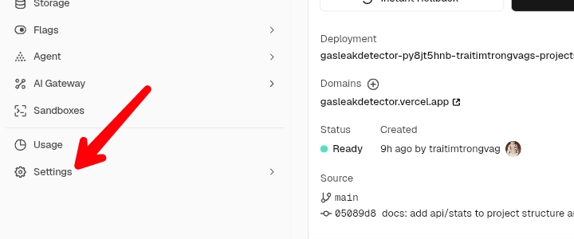

**Bước 3.** Chọn mục **Environment Variables**.

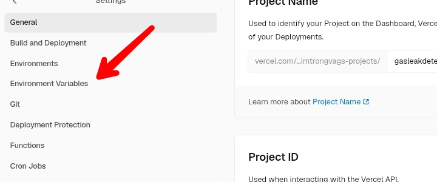

**Bước 4.** Nhấn **Add Environment Variable**.

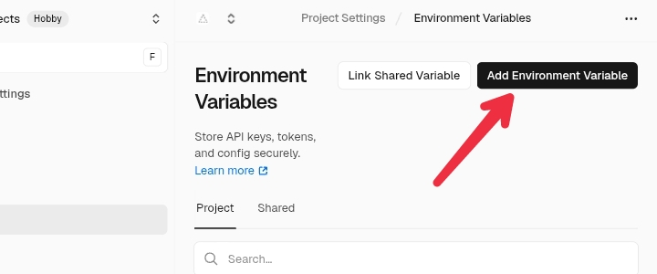

**Bước 5.** Thêm lần lượt các biến sau:

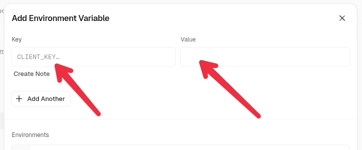

| Biến | Mô Tả |
|------|--------|
| `SUPABASE_URL` | URL dự án Supabase của bạn |
| `SUPABASE_ANON_KEY` | Supabase anonymous key — dùng cho WebSocket của ứng dụng Android |
| `SUPABASE_SERVICE_KEY` | Supabase service role key — dùng cho toàn bộ thao tác ghi phía server |
| `VALID_API_KEY` | Khóa bí mật chung được gửi qua header `x-api-key` bởi ESP và app |
| `RESEND_API_KEY` | API key của Resend để gửi cảnh báo qua email |
| `ALERT_EMAIL` | Địa chỉ email nhận cảnh báo khi mức khí đạt ngưỡng nguy hiểm |
| `DANGER_THRESHOLD` | Mức PPM kích hoạt trạng thái `danger`. Khuyến nghị: `800` cho MQ-6 |
| `WARNING_THRESHOLD` | Mức PPM kích hoạt trạng thái `warning`. Khuyến nghị: `300` cho MQ-6 |
| `EMAIL_COOLDOWN_MINUTES` | Thời gian tối thiểu (phút) giữa các lần gửi email cảnh báo liên tiếp. Mặc định: `2` |

### API Key

`VALID_API_KEY` là khóa bí mật do bạn tự đặt — được dùng chung giữa server, firmware ESP và ứng dụng Android. Không cần đăng ký hay dịch vụ bên thứ ba nào.

Khuyến nghị: 8–10 ký tự chữ và số. Ví dụ: `Abc12345`.

### Resend (Cảnh Báo Qua Email)

Phần này là tùy chọn. Bỏ qua nếu bạn không cần nhận cảnh báo qua email.

**Bước 1.** Đăng nhập hoặc tạo tài khoản tại [resend.com](https://resend.com/login).

**Bước 2.** Vào **API Keys** và nhấn **Create API Key**.

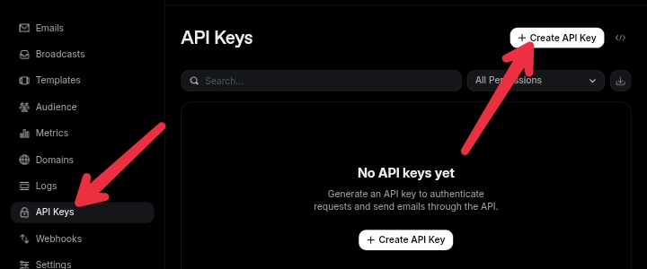

**Bước 3.** Điền tên key và nhấn **Add**.

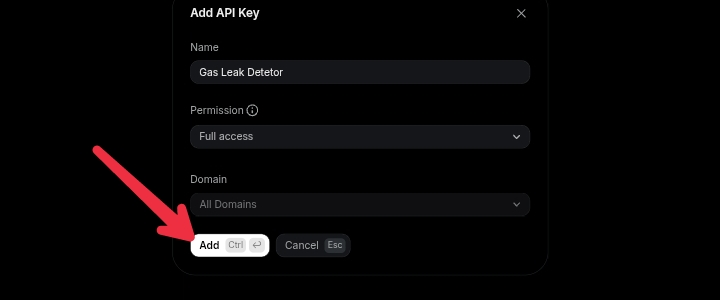

**Bước 4.** Nhấn Copy để sao chép key.

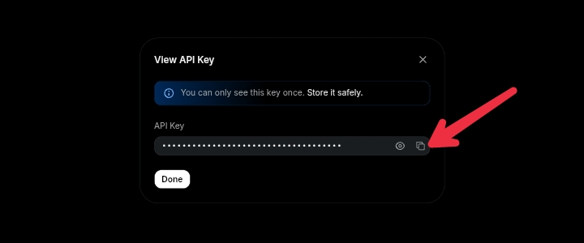

Gán vào `RESEND_API_KEY` trong Vercel. Đặt `ALERT_EMAIL` là địa chỉ email muốn nhận cảnh báo (ví dụ: `you@gmail.com`).

---

## 2. Supabase

**Bước 1.** Tạo project mới trong Supabase.

**Bước 2.** Mở SQL Editor, dán toàn bộ nội dung của [`supabase/schema.sql`](https://github.com/gasleakdetector/gasleakdetector-server/blob/main/supabase/schema.sql) vào và chạy một lần duy nhất.

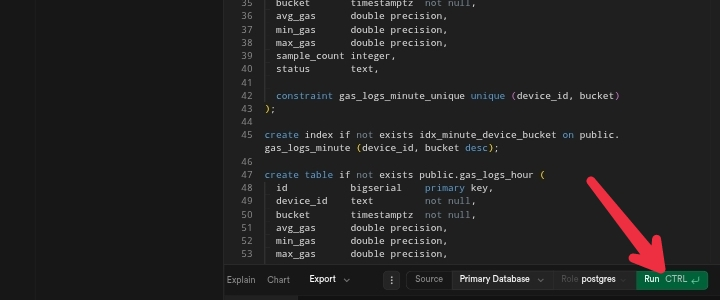

Lệnh này sẽ tạo toàn bộ các bảng (`gas_logs_raw`, `gas_logs_minute`, `gas_logs_hour`, `devices`), các hàm tổng hợp dữ liệu, các lịch `pg_cron` và chính sách bảo mật Row Level Security chỉ trong một lần chạy.

**Bước 3.** Lấy thông tin API. Vào **Settings > API Keys > Legacy anon, service_role API keys** và sao chép cả hai khóa `anon` và `service_role`.

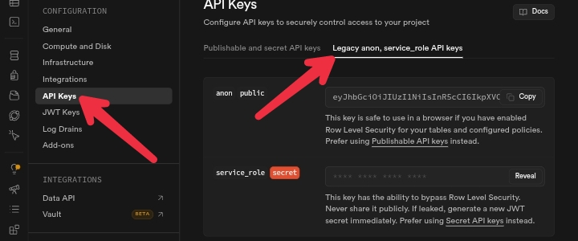

Gán chúng vào `SUPABASE_ANON_KEY` và `SUPABASE_SERVICE_KEY` trong Vercel. `SUPABASE_URL` có thể lấy trong phần **Project Overview**.

---

## 3. Firmware ESP8266

### Đấu Nối

Kết nối các thiết bị với ESP8266 theo sơ đồ bên dưới trước khi cấp nguồn.

**Cảm Biến MQ-6**

| MQ-6 | ESP8266 |
|------|---------|
| VCC | VIN (5V) |
| GND | GND |
| AO | A0 |

**OLED SSD1306 (tùy chọn)**

| OLED | ESP8266 |
|------|---------|
| VCC | 3.3V |
| GND | GND |
| SCL | D1 / GPIO5 |
| SDA | D2 / GPIO4 |

**Buzzer**

| Buzzer | ESP8266 |
|--------|---------|
| + | D5 / GPIO14 |
| − | GND |

### Nạp Firmware

Tải file `.bin` mới nhất tại trang [gasleakdetector-esp releases](https://github.com/gasleakdetector/gasleakdetector-esp/releases) và nạp vào ESP8266 bằng công cụ phù hợp (esptool, Arduino IDE hoặc ESP Flash Download Tool).

Quy trình nạp mã không được trình bày chi tiết ở đây — tham khảo repository firmware để biết thêm.

### Cấu Hình Lần Đầu

**Bước 1.** Cấp nguồn cho ESP8266. Thiết bị sẽ phát ra một mạng Wi-Fi. Kết nối vào mạng đó.

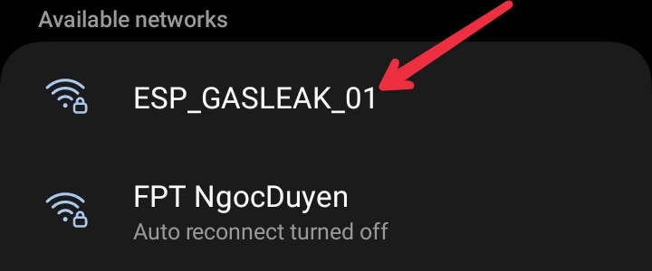

**Bước 2.** Mở trình duyệt và truy cập `http://192.168.4.1`. Captive portal sẽ tự động mở trên hầu hết các thiết bị. Điền thông tin:

- **SSID / Password** — thông tin Wi-Fi nhà bạn
- **API KEY** — `VALID_API_KEY` đã cài trong Vercel

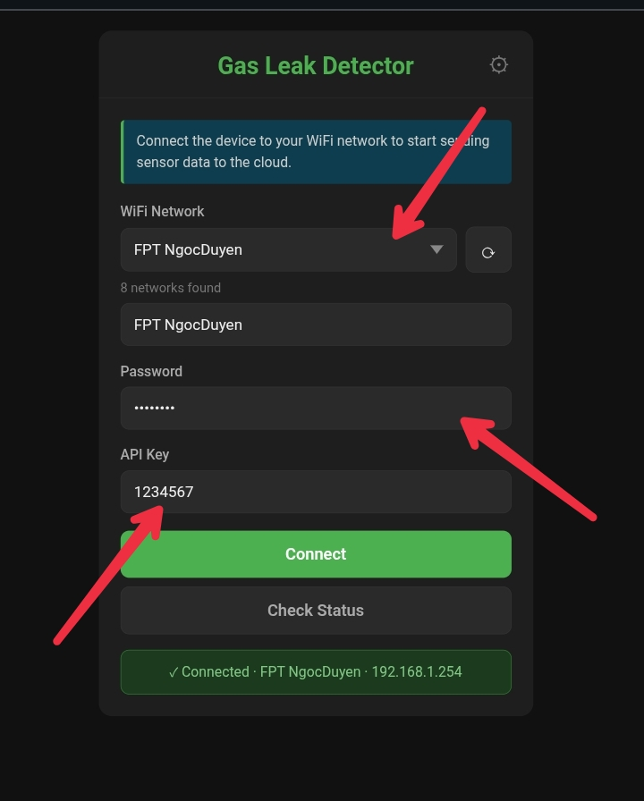

**Bước 3.** Vào **Settings** (góc trên bên phải). Điền **API Host** là URL Vercel của bạn (ví dụ: `https://your-app.vercel.app`), sau đó nhấn **Save Config**.

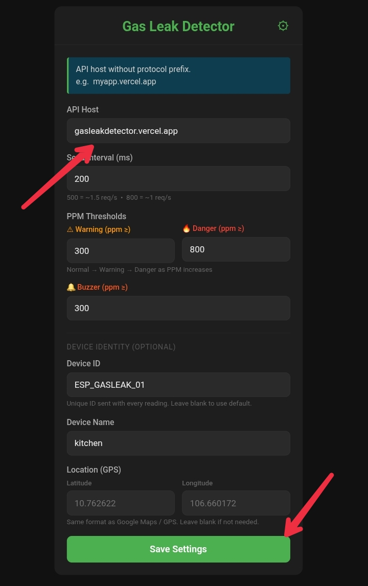

**Bước 4.** Reset ESP để áp dụng cài đặt mới. Thiết bị sẽ kết nối Wi-Fi và bắt đầu gửi dữ liệu.

---

## 4. Ứng Dụng Android

### Cài Đặt

Tải file APK mới nhất tại [trang releases](https://github.com/gasleakdetector/gasleakdetector/releases/latest) và cài đặt lên thiết bị Android của bạn.

### Cấu Hình

**Bước 1.** Mở ứng dụng và nhấn vào icon bút chì ở góc trên bên phải màn hình chính.

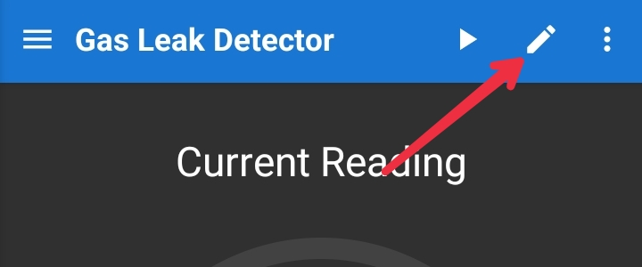

**Bước 2.** Điền thông tin cài đặt:

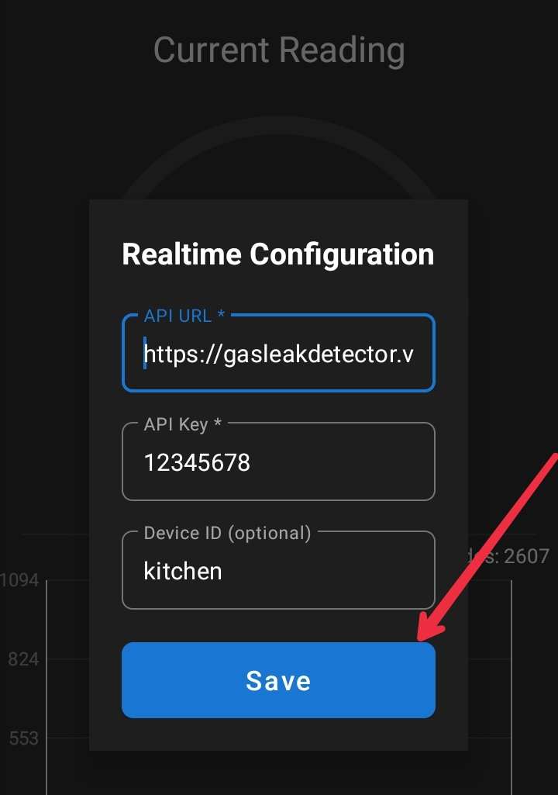

| Trường | Giá Trị |
|--------|---------|
| API URL | URL Vercel của bạn |
| API Key | `VALID_API_KEY` bạn đã đặt |
| Device ID | `device_id` của ESP (ví dụ: `ESP_GASLEAK_01`). Để trống để theo dõi tất cả thiết bị. |

Nhấn **Save**. Ứng dụng sẽ kết nối và hiển thị dữ liệu theo thời gian thực.

---

## Xử Lý Sự Cố

**ESP không kết nối được Wi-Fi** — kiểm tra lại SSID và mật khẩu trong captive portal. Giữ nút 5 giây để reset về mặc định và cài đặt lại.

**Ứng dụng không hiển thị dữ liệu** — kiểm tra API URL và API Key có khớp chính xác với cài đặt trong Vercel không. Xem Vercel function logs để tìm lỗi.

**Không nhận được email cảnh báo** — xác nhận `RESEND_API_KEY` và `ALERT_EMAIL` đã được cài đặt trong Vercel. Cảnh báo chỉ gửi khi trạng thái đạt mức `danger` và đã qua thời gian cooldown.

**Lỗi khi chạy Supabase schema** — đảm bảo SQL được chạy đúng project và extension `pg_cron` đã được kích hoạt (Supabase bật mặc định trên gói trả phí; gói miễn phí có thể cần kích hoạt thủ công).

---

*Nếu có thắc mắc hoặc gặp sự cố, hãy tạo [GitHub issue](https://github.com/gasleakdetector/gasleakdetector/issues) hoặc liên hệ qua [pan2512811@gmail.com](mailto:pan2512811@gmail.com). Mọi đóng góp đều được chào đón 😊*
